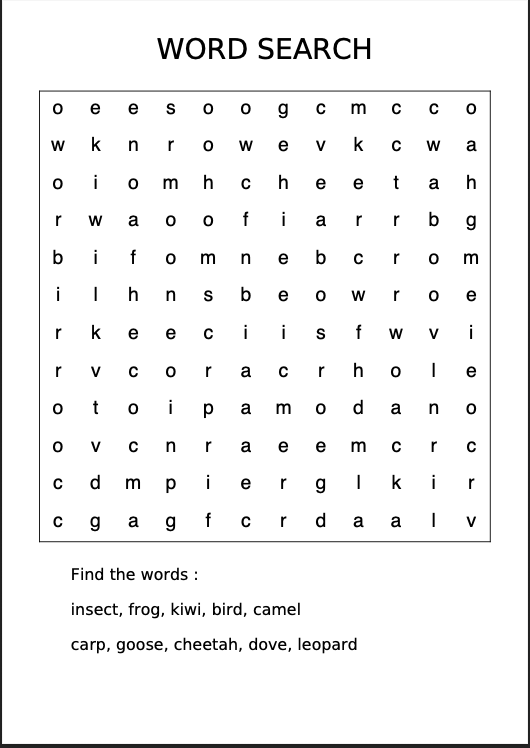

# Word Search Generator

A simple Python tool to generate word search puzzles in PDF format, including support for English, numbers, and Chinese characters.

## Example



## Getting Started

### Prerequisites

- [uv](https://github.com/astral-sh/uv) (for managing Python environments and dependencies)

### Installation

```bash
git clone https://github.com/bjornjee/word-search.git
cd word-search
make install
```

### Running the Generator

To generate the puzzles, run:

```bash
make run
```

This will generate the PDF files in the `puzzles/` directory.

### Cleaning Up

To remove generated puzzles and temporary files:

```bash
make clean
```
